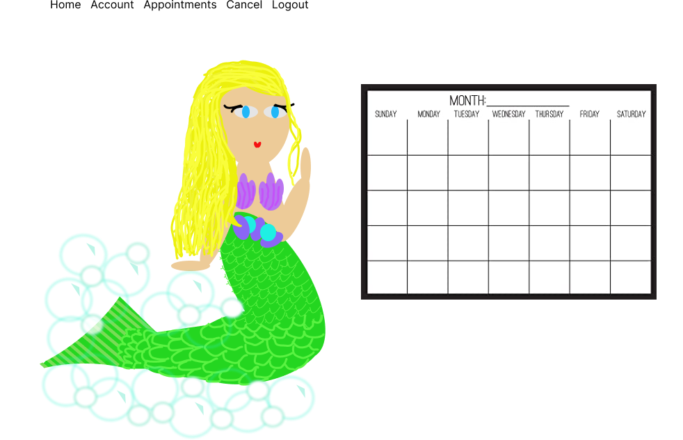
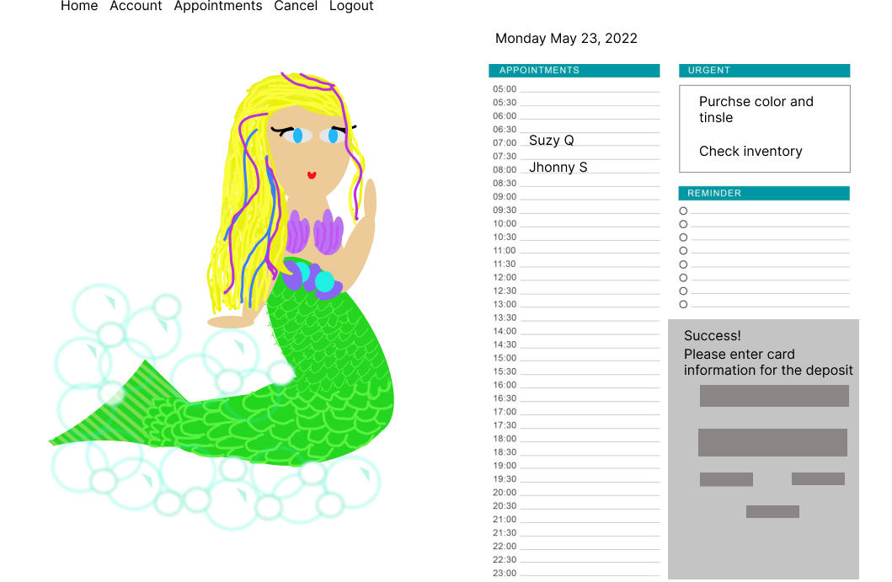

# Description

Tangle's and Waves brings you an application to book your child's next hair appointment or birthday party.

## Table of Contents

- [Installation](#installation)
- [Usage](#usage)
- [License](#license)
- [Contributing](#contributing)
- [Tests](#tests)
- [Questions](#questions)

## Installation

The user should clone the repository from GitHub. To run the app from the terminal cd into tangles-waves and enter `npm start`. This application requires:
"dependencies": {
  "@date-io/date-fns": "^2.0",
    "@emotion/react": "^11.8.2",
    "@emotion/styled": "^11.8.1",
    "@mui/core": "^5.0.0-alpha.54",
    "@mui/icons-material": "^5.5.1",
    "@mui/lab": "^5.0.0-alpha.24",
    "@mui/material": "^5.5.3",
    "@mui/styled-engine-sc": "^5.5.2",
    "@mui/x-data-grid": "^5.8.0",
    "@mui/x-data-grid-generator": "^5.8.0",
    "@stripe/react-stripe-js": "^1.7.1",
    "@stripe/stripe-js": "^1.27.0",
    "@testing-library/jest-dom": "^5.16.3",
    "@testing-library/react": "^12.1.4",
    "@testing-library/user-event": "^13.5.0",
    "bootstrap": "^5.1.3",
    "date-fns": "^2.0.0-beta.5",
    "react": "^17.0.1",
    "react-dom": "^17.0",
    "react-scripts": "5.0.0",
    "styled-components": "^5.3.5",
    "web-vitals": "^2.1.4"
},
"devDependencies": {
"concurrently": "^5.1.0"
"nodemon": "^2.0.3"
"last 1 chrome version",
"last 1 firefox version",
"last 1 safari version"
}

## Usage

This application will allow users to book a hair appointment or birthday party.
 
  
 
 

## License

This project does not have a license.

## Contributing

Contributors should read the installation section.

## Tests

There are no tests for this application.

## Questions

If you have any questions about this projects, please contact me directly at christimarchetti@gmail.com. You can view more of my projects at https://github.com/chl850405.
